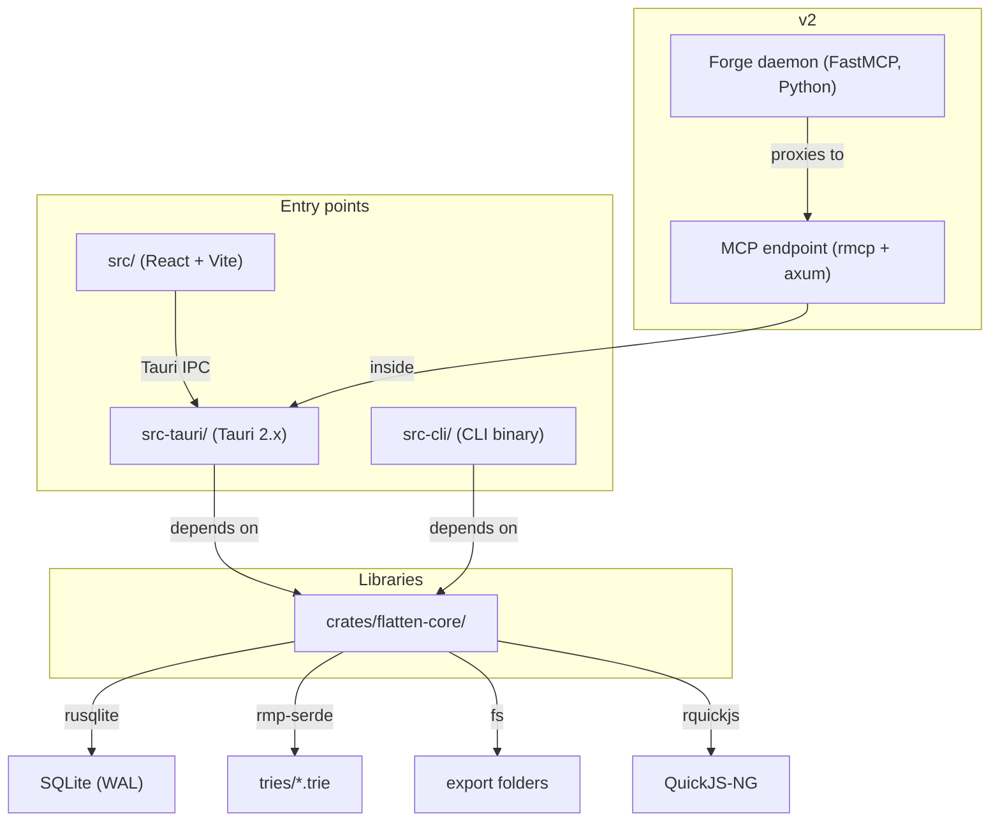
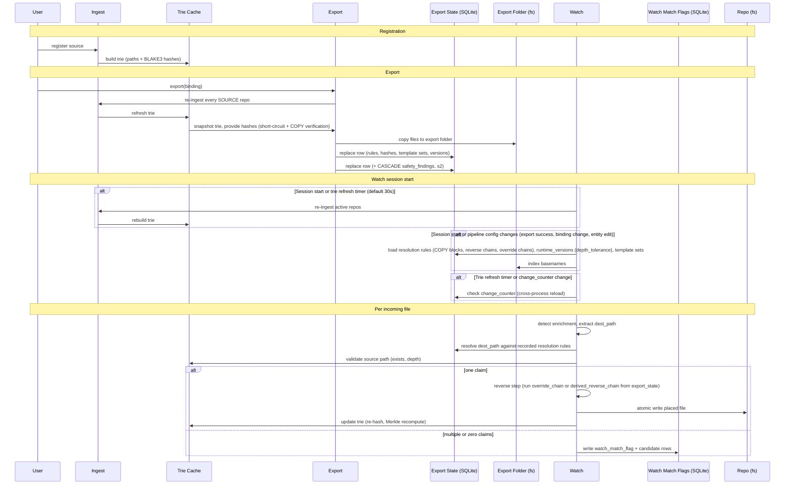

<!-- docs/design/0_SUMMARY.md -->
# Flatten PM Design

Architecture, contracts, and decisions.


# Goal

Flatten PM is a desktop app that syncs codebases with AI project UIs (Claude
Projects, ChatGPT, Gemini). It exports repos in the shape each platform needs
and places the AI's files back where they came from. The differentiator is safe
placement back and the audit trail; no chat-UI platform serves either.

Agent-based tools (Claude Code, Cursor, Aider, Cline, Codex, Windsurf) cover
the full workflow natively. Flatten PM fills no gap for agent users.

## Stages

v1 = s1 + s2. v2 = s3.

### s1: Core engine + CLI

All pipeline logic in `flatten-core`, exposed through the `flatten` CLI. No
desktop UI beyond the Tauri shell. s1 is the complete bidirectional sync
engine; s2 wraps it in a product.

**What the user can do:**

- Register repos, configure ingest excludes (seed from `.gitignore`, edit).
- Write recipes (`SOURCE`, `COPY` with per-file transform chains, `RUN`, `INVOKE`,
  `WATCH` block). Bind a recipe to repos with ARG values.
- Export: run a recipe, get a folder of flattened files with enrichment
  injected. Each export writes a new UUID directory; on success, the previous
  directory is deleted. Whole-run short-circuit skips
  unchanged exports.
- Watch: monitor a source directory, detect enrichment in incoming files,
  resolve against recorded `COPY` blocks (gitignore-style rule evaluation),
  reverse the forward chain, place files back in the repo. Configurable depth
  tolerance (per-recipe `WATCH` block). Serial file processing.
- Emit aggregated context files via the context-manifest transform.

**What exists under the hood:**

- Block-structured recipe language with hand-rolled parser.
- Two transform scopes (file, directory) as JavaScript in QuickJS-NG.
  Transform imports. Shipped builtin transforms.
- Enrichment injection/extraction via typed template sets.
- Export state row: one row per binding, replaced on success (ADR-037). Stores
  the `COPY` blocks (including per-key reverse chains and override chains),
  template sets, instructions, depth tolerance, and hashes that watch and
  short-circuit read.
- Pointer-based versioning for recipes, transforms, and templates.
- SQLite (WAL) with single writer thread (ADR-038). Trie cache (MessagePack).

### s2: Desktop UI + product features

The desktop GUI and features that need it. The engine is s1; s2 makes it a
product.

- Desktop UI for managing repos, recipes, transforms, and templates (editing,
  versioning, rollback, restore-from-shipped, pruning).
- Flag review and resolution (approve, dismiss, inspect frozen candidates).
- File history: append-only audit trail with snapshot+diff chains per file.
- Content safety scanning at export (flag-only, configurable thresholds).
- System tray integration.
- Zip and clipboard as watch sources.

### s3: v2+

- MCP backend (rmcp, axum, Streamable HTTP on localhost).
- MCP tools (read_file, list_files, search_across_projects).
- Forge daemon (FastMCP, prefixed tool mounts, .mcpb bundle).
- Platform compatibility testing.

# Architecture Overview

Tauri 2.x desktop app with a Rust backend and a React frontend via Vite. The
core logic lives in `flatten-core`, a standalone library crate with no Tauri or
GUI dependencies. The Tauri app, the `flatten` CLI, the MCP server (v2), and
tests all consume it independently.

Three stages share one set of stores and one recipe type. Three stores hold
the state.

## Components



`flatten-core` owns all pipeline logic, storage, and the transform runtime. No
pipeline logic lives in the Tauri layer or the CLI; both are thin dispatch over
`flatten-core` functions.

```
flatten-pm/
  src/                    # React frontend (Vite)
  src-tauri/              # Tauri app (desktop entry point)
  src-cli/                # CLI binary (development entry point)
  crates/
    flatten-core/         # Library crate (no Tauri deps)
  scripts/
    flatten-sync/         # Python prototype (production reference, not shipped)
```


## Tech Stack

| Layer | Choice |
|---|---|
| Languages | Rust, TypeScript, JavaScript (all transforms), Python (forge daemon v2) |
| Backend | Rust, `flatten-core` library crate (standalone from Tauri) |
| Frontend | React via Vite |
| Desktop shell | Tauri 2.x |
| Transform runtime | QuickJS-NG via rquickjs |
| Database | SQLite via rusqlite (bundled feature, WAL mode) |
| Trie serialization | MessagePack via rmp-serde |
| Hashing | BLAKE3 |
| Diffing | imara-diff |
| Filesystem watching | notify 8.x with notify-debouncer-full |
| Gitignore patterns | ignore crate |
| Template engine | MiniJinja |
| MCP server (v2) | rmcp + axum (Streamable HTTP on localhost) |
| Forge daemon (v2) | FastMCP (Python) |

## Three Stores

| Store | What it holds | Written by | Read by |
|---|---|---|---|
| **Trie cache** `tries/{repo_id}.trie` | Paths and hashes. What the repo contains now. | Ingest; watch (on placement). | Export (root hash for short-circuit, per-file hash at `COPY`). Watch (source path validation). |
| **Export folder** `{app_data}/export/binding-{id}/{uuid}/` | Real files. What was last uploaded. App-owned. | Export only. | Watch (reconciliation: skip unchanged re-downloads). Never read for placement. |
| **Export state** `export_state` row | How the export folder was made. One row per binding, replaced on success. | Export only. | Short-circuit (runtime inputs, repo hashes, versions). Watch (resolution rules with per-key reverse chains and override chains, depth tolerance, template set versions). |

## Stage integration

How the three stores connect the three stages.




## Design files

All design files live in `docs/design/`. ADRs and vocabulary are siblings in
`docs/`.

| File | What |
|---|---|
| `0_SUMMARY.md` | This file. Goal, architecture, stage integration. |
| `1_INFRASTRUCTURE.md` | Database, Settings, CLI, Error Model. |
| `2_INGEST.md` | Repos, Ingest Flow, Trie, Ingest Rules. |
| `3_RECIPES.md` | Recipe model, Grammar, Parse output, Transform, Template, Enrichment, Binding. |
| `4_EXPORT.md` | Export Flow, Export State, Short-circuit, Export Folder, Context Accumulator, Run Report. |
| `5_WATCH.md` | Watch Flow, Detection, Resolution, State, Return Step, Reconciliation, Match Flags, Watch Report. |
| `6_VERSIONING.md` | Versioning, Shipped Defaults, File History. |
| `../ADR.md` | Architecture decision records (54). |
| `../VOCABULARY.md` | Term list with contract pointers. |
