<!-- docs/design/1_INFRASTRUCTURE.md -->

# Infrastructure

## Database

SQLite (rusqlite, bundled feature, WAL mode). All storage accessible from
`flatten-core` with no Tauri dependencies.

All relative paths in contracts (`tries/`, `export/`, the database file) resolve under the OS's app data directory.

**SQLite access pattern:**

| Role | How |
|---|---|
| Writer | One dedicated thread owning the write connection, fed by a channel whose messages are whole transactions. No connection shared across threads or held across an await. |
| Readers | Separate connections per caller, read-only. |
| Schema migrations | Run inside `BEGIN IMMEDIATE` so the CLI and the app cannot race. Schema versioned via `PRAGMA user_version`. |
| WAL checkpoint | Periodic flush of the write-ahead log into the main database. Runs when no export is active to avoid I/O contention. |
| Busy timeout | All connections set `busy_timeout` (e.g. 5000ms). The single-writer model is per process; two processes (app + CLI) can contend on the write lock. |

**Tables (16):**

| Table | What |
|---|---|
| `repos` | Registered sources. Path, name, `ingest_patterns`, `line_ending_policy`, `trie_updated_at`, `deleted_at`. s2 adds `safety_allowlist`. |
| `repo_versions` | Append-only config versioning. Snapshots `ingest_patterns`, `line_ending_policy` (and `safety_allowlist` in s2) per edit. |
| `build_recipes` | Recipe parent entities. Name, `current_version_id`, `deleted_at`. |
| `build_recipe_versions` | Recipe text. `source`, version number. |
| `transforms` | Transform parent entities. Name, scope (file/directory), curation (builtin/custom), `current_version_id`, `deleted_at`. |
| `transform_versions` | Transform JS. `source`, version number. |
| `templates` | Template parent entities. Name, curation (builtin/custom), kind (enrichment/file), `current_version_id`, `deleted_at`. |
| `template_versions` | Template text. `source`, version number. |
| `pipeline_bindings` | Binding records. Recipe FK, pin, active, `arg_values`. |
| `export_state` | One row per binding. Runtime inputs, repo hashes, resolution rules (including per-key reverse chains and override chains), runtime versions (including depth_tolerance). See Export state contract. |
| `watch_match_flags` | Watch files that could not be auto-placed. One row per detection. |
| `watch_match_candidates` | Per-flag resolution results. One row per binding per flag, written for every binding (not just viable candidates). Carries status (`ok`, `exceeds_depth`, `excluded`, `no_match`), frozen reverse chain, and template set version. |
| `safety_findings` | s2. Export safety scan results. CASCADE from `export_state`. |
| `file_history` | Audit trail (s2). Snapshots and diffs per file. |
| `settings` | Global KV. See Settings contract. |
| `change_counter` | Single-row monotonic counter. Bumped inside the same transaction as every export success, binding activate/deactivate/delete, and entity pointer move. Watch polls this for cross-process reload. |

**Entity ER** (FK lines from `file_history`, `watch_match_candidates`, and
`safety_findings` to `repos` omitted for clarity):

```mermaid
erDiagram
    repos {
        int id PK
        text path
        text name "unique"
        json ingest_patterns
        text line_ending_policy "preserve | lf"
        json safety_allowlist "nullable, s2"
        datetime trie_updated_at "nullable"
        datetime created_at
        datetime deleted_at "nullable"
    }

    repo_versions {
        int id PK
        int repo_id FK
        int version
        json ingest_patterns
        text line_ending_policy "preserve | lf"
        json safety_allowlist "nullable, s2"
        datetime created_at
    }

    build_recipes {
        int id PK
        text name "unique"
        int current_version_id FK
        datetime deleted_at "nullable"
    }

    build_recipe_versions {
        int id PK
        int build_recipe_id FK
        int version
        text source
        datetime created_at
        datetime deleted_at "nullable"
    }

    transforms {
        int id PK
        text name "unique"
        text scope "file | directory"
        text curation "builtin | custom"
        text reverses "nullable, references transforms.name"
        int current_version_id FK
        datetime deleted_at "nullable"
    }

    transform_versions {
        int id PK
        int transform_id FK
        int version
        text source
        datetime created_at
        datetime deleted_at "nullable"
    }

    templates {
        int id PK
        text name "unique"
        text curation "builtin | custom"
        text kind "enrichment | file"
        int current_version_id FK
        datetime deleted_at "nullable"
    }

    template_versions {
        int id PK
        int template_id FK
        int version
        text source
        datetime created_at
        datetime deleted_at "nullable"
    }

    pipeline_bindings {
        int id PK
        int build_recipe_id FK
        int version_pin "nullable, null = follow current"
        bool active
        json arg_values
        datetime created_at
        datetime last_used_at "nullable"
    }

    export_state {
        int id PK
        int pipeline_binding_id FK "unique: one row per binding"
        text output_dir "binding-id/uuid/"
        json resolution_rules "per COPY key: repo, prefixes, excludes, forward chain, derived reverse chain, override chain"
        json runtime_versions "recipes, directory transforms, template sets, depth_tolerance"
        json runtime_inputs "resolved ARGs + copy_size_limit_mb + binary_extensions"
        json repo_root_hashes "repo_id to trie Merkle root"
    }

    watch_match_flags {
        int id PK
        text flag_type "ambiguous | new_directory | unroutable"
        blob content
        text source_path
        text extracted_path
        datetime created_at
    }

    watch_match_candidates {
        int id PK
        int watch_match_flag_id FK
        int pipeline_binding_id FK "nullable, SET NULL on binding delete"
        int build_recipe_version_id FK "nullable, SET NULL on version delete"
        int repo_id FK
        text target_path "nullable (null when status is excluded or no_match)"
        text copy_key "nullable (null when status is excluded or no_match)"
        text status "ok | exceeds_depth | excluded | no_match"
        json resolved_reverse_chain "reverse chain snapshot at detection time"
        int template_set_version "nullable, template set version whose pattern matched"
    }

    safety_findings {
        int id PK
        int export_state_id FK "CASCADE on delete"
        int repo_id FK
        text file_path
        text finding_type "secret_detected | pii_detected"
        text rule_id
        datetime created_at
    }

    settings {
        text key PK
        text value
        datetime updated_at
    }

    change_counter {
        int id PK "single row, id=1"
        int counter "monotonic counter"
    }

    file_history {
        int id PK
        int repo_id FK "nullable (packed/emitted files)"
        int build_recipe_version_id FK "nullable, SET NULL on delete"
        text file_path
        text entry_type "snapshot | diff"
        blob content
        text placed_by "export | watch_auto | watch_manual"
        text source_path "nullable (export entries)"
        datetime created_at
    }

    trie_cache_filesystem["trie_cache (filesystem)"] {
        int repo_id PK "tries/repo_id.trie"
        blob data
        datetime updated_at
    }

    build_recipes ||--o{ build_recipe_versions : "versions"
    build_recipes ||--o{ pipeline_bindings : "activated by"
    pipeline_bindings ||--o| export_state : "last successful run"
    repos ||--o| trie_cache_filesystem : "computed from ingest"
    repos ||--o{ repo_versions : "config edits"
    transforms ||--o{ transform_versions : "versions"
    templates ||--o{ template_versions : "versions"
    watch_match_flags ||--o{ watch_match_candidates : "proposed targets"
    export_state ||--o{ safety_findings : "scan results"
```

**Uniqueness constraints:**

| Constraint | On |
|---|---|
| `(name)` unique | `repos` (referenced by `SOURCE` instructions) |
| `(name)` unique | `build_recipes` |
| `(name)` unique | `transforms` (referenced by `reverses`, `RUN`, `COPY` chains) |
| `(name)` unique | `templates` (referenced by `--template-set`) |
| `(build_recipe_id, version)` | `build_recipe_versions` |
| `(transform_id, version)` | `transform_versions` |
| `(template_id, version)` | `template_versions` |
| `(pipeline_binding_id)` unique | `export_state` (one row per binding) |
| `(watch_match_flag_id, pipeline_binding_id, repo_id)` | `watch_match_candidates` (one candidate row per binding per flag; `target_path` is nullable so removed from constraint) |
| `(export_state_id, repo_id, file_path)` | `safety_findings` |

**FK actions:**

| FK | On delete |
|---|---|
| `build_recipe_versions` deletion | Sets null on `file_history.build_recipe_version_id` and `watch_match_candidates.build_recipe_version_id` |
| `pipeline_bindings` deletion | Cascades `export_state` (which cascades `safety_findings`), sets null on `watch_match_candidates.pipeline_binding_id` |
| `watch_match_flags` deletion | Cascades `watch_match_candidates` |

**Filesystem (not in SQLite):**

| Location | What | Owner |
|---|---|---|
| `{app_data}/tries/{repo_id}.trie` | MessagePack trie per repo | Ingest, Watch |
| `{app_data}/export/binding-{binding_id}/{uuid}/` | Export directory (nested files) | Export |
| `{app_data}/export/binding-{binding_id}/.lock` | Per-binding export lock file. Acquired at export start, released at end (success or failure). Prevents concurrent export of the same binding. | Export |
| `{app_data}/watch.pid` | PID file written by watch session, deleted on clean stop. Used by `watch stop` (send signal) and `watch status` (liveness check). | Watch |

**Soft delete:** `deleted_at` timestamp on `repos`, `build_recipes`,
`transforms`, `templates`. Queries filter `deleted_at IS NULL`.

**Active binding guard:** soft-deleting a repo or recipe with active bindings
is a domain error naming the bindings. Deactivate or delete the bindings
first.

## Settings

Global key-value configuration. Simple KV table in SQLite.

| Key | Type | Default | Read by |
|---|---|---|---|
| `watch_source_dir` | path | unset | Watch (source directory) |
| `watch_poll_interval_ms` | int | 30000 | Watch (sweep timer) |
| `watch_settle_ms` | int | 500 | Watch (download settle check) |
| `watch_debounce_ms` | int | 250 | Watch (notify debounce) |
| `trie_refresh_interval_ms` | int | 30000 | Watch (trie refresh timer) |
| `transform_timeout_ms` | int | 10000 | Transform runtime (per-call timeout) |
| `transform_memory_mb` | int | 256 | Transform runtime (per-call memory limit) |
| `copy_size_limit_mb` | int | 64 | Export (max file size for `COPY`) |
| `binary_extensions` | list | seeded list | Export (`EXCLUDE` --binary) |

`watch_source_dir` has no default. OS-detected download paths surfaced as
suggestions when unset.

Note: `DEPTH_TOLERANCE` and line-ending policy are per-repo/per-recipe, not
global settings. `DEPTH_TOLERANCE` lives in the recipe's WATCH block.
Line-ending policy lives in `repos.line_ending_policy`.

## CLI

The `flatten` binary in `src-cli/`. Thin subcommand dispatch over `flatten-core`
functions. Development entry point for all `flatten-core` operations until the
desktop UI is functional.

**Subcommand groups:**

| Group | What |
|---|---|
| `db` | `init`, `tables`, `query` (read-only). |
| `repo` | `add`, `ls`, `tree`, `history`, `rollback`, `rm`, `edit`, `reingest`. |
| `recipe` | `add`, `new`, `show`, `args`, `edit`, `history`, `rollback`, `ls`, `rm`, `lint`. |
| `transform` | `add`, `ls`, `run`, `rm`, `reset`. |
| `template` | `add`, `ls`, `show`, `edit`, `history`, `rollback`, `reset`, `rm`. |
| `binding` | `add`, `ls`, `rm`, `activate`, `deactivate`, `pin`, `set-arg`. |
| `export` | `<binding_id> [--arg NAME=value] [--force] [--dry-run] [--json]`. |
| `watch` | `start`, `stop`, `status`. `stop` sends SIGTERM via PID file (Unix) or writes a stop-request file (cross-platform). `status` reads PID file for liveness and running counters from the database. |
| `flag` | `ls`, `show`, `dismiss`, `approve <id> <candidate>`, `explain <file>`. `explain` runs detection and per-binding resolution without placing, prints every rule evaluated and every candidate with its status. |
| `history` | `show <repo> <path>`, `rollback <repo> <path> <entry>`. |
| `settings` | `get <key>`, `set <key> <value>`. |

**Conventions:**

| Convention | Rule |
|---|---|
| `--data-dir <path>` | Override app data directory for tries, export folders, database, PID file. Everything resolves under this path instead of the OS default. |
| `--db <path>` | Override database location. Default is the app data directory (or `--data-dir` if set). |
| `--json` | Machine-readable JSON on stdout. Human output otherwise. |
| Exit 0 | Success. |
| Exit 1 | Domain error (bad input, not found). |
| Exit 2 | Usage error. |
| Errors | Stderr, one line. `--json` wraps as `{"error": ...}`. |
| SIGINT/Ctrl+C | Long-running commands (watch) stop cleanly: in-flight placement finishes, never half-written. Exit 0. |

**Fixtures convention:** `fixtures/<name>/` for repos, `fixtures/recipes/*.recipe`,
`fixtures/transforms/*.js`, `fixtures/downloads/` for watch inputs.

## Error Model

The `flatten-core` error enum and its mapping to CLI exit codes and JSON
serialization.

| Category | Examples | CLI exit | JSON |
|---|---|---|---|
| Domain | Recipe parse error, unknown repo name, missing required ARG, duplicate name, nonexistent version | 1 | `{"error": "...", "kind": "domain", "detail": {...}}` |
| Usage | Unknown subcommand, missing argument, invalid flag | 2 | `{"error": "...", "kind": "usage"}` |
| IO | File not found, permission denied, disk full | 1 | `{"error": "...", "kind": "io", "path": "..."}` |
| Transform | JS throw, timeout, memory limit | 1 | `{"error": "...", "kind": "transform", "name": "...", "line": N}` |
| Database | Migration failure, write conflict | 1 | `{"error": "...", "kind": "database"}` |

All errors carry a human-readable message on stderr. `--json` wraps them with
a `kind` discriminator and structured detail.

Parse errors carry line and column. Transform errors carry the module name and,
when available, the JS line number.

