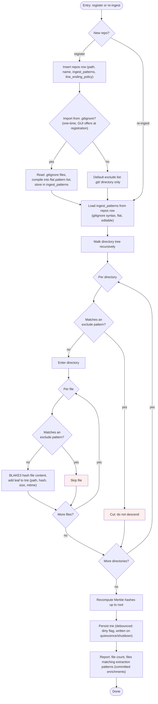

<!-- docs/design/2_INGEST.md -->

# Ingesting Data Sources

**Ingest** registers a source (a repo, a docs folder), configures what to
exclude, and builds a trie from the included files.

The configuration workflow follows a seed-then-own pattern (config ejection):

1. **Register** the source by path and name.
2. **Seed the exclude list** (optional): import from `.gitignore` files in the
   source. The import walks the directory for `.gitignore` files, compiles their
   patterns into a flat list, and stores it. This is a one-time read, not a live
   dependency.
3. **Edit the list** in the GUI. Add patterns, remove patterns, preview the
   match set. The stored `ingest_patterns` column is the source of truth from here.
4. **Walk** the source under the stored pattern list (gitignore syntax via the
   `ignore` crate). Excluded directories are cut during the walk, never after.
   Each included file becomes a trie leaf with a BLAKE3 content hash (raw file
   bytes, no normalization). Symlinks are not followed; the link itself is a leaf
   whose content is the link target string.

The trie holds paths and hashes, nothing else. It is the input to every export
(root hash for the short-circuit, per-file hash for `COPY` verification) and the
validation target for every watch placement. Watch also writes to the trie when
it places a file.

Ingest exclude keeps the trie clean: don't walk or hash what you'll never need.
`COPY` `EXCLUDE` (in the recipe) keeps the export clean: don't include what this
particular export doesn't need. Two layers, two concerns.


## Repos


A registered source directory.

| Field | Type | What |
|---|---|---|
| `id` | int | PK |
| `path` | text | Absolute path to the source directory. |
| `name` | text | Unique. What `SOURCE` instructions reference. |
| `ingest_patterns` | json | Gitignore-style pattern list. Seeded from `.gitignore` import or default (`.git/` only). Editable in GUI. |
| `line_ending_policy` | text | `preserve` (default) or `lf`. Applied by watch at placement. |
| `safety_allowlist` | json, nullable | s2. Rule IDs and paths to skip during export safety scan. |
| `trie_updated_at` | datetime, nullable | When the trie file was last persisted. |
| `created_at` | datetime | |
| `deleted_at` | datetime, nullable | Soft delete. |

Clear error on non-existent root path or duplicate name at registration.

## Ingest Flow


Referenced by: Trie contract, Ingest rules contract.

Two entry points: initial registration (new repo) and re-ingest (existing repo,
called by export and watch). Both follow the same walk; registration also
inserts the repos row.



**Two exclusion layers:**
- **Ingest exclude** (stored pattern list on the repo): keeps the trie clean.
  Don't walk or hash what you'll never need.
- **`COPY` `EXCLUDE`** (per-`COPY` block in the recipe): keeps the export clean.
  Don't include what this particular export doesn't need.

Ingest patterns use gitignore syntax (via the `ignore` crate) but are a stored
flat list, not a live `.gitignore` dependency. At registration, the GUI offers
to import from `.gitignore` as a one-time seed. After that, the stored list is
the source of truth. A "diff against current .gitignore" action (s2) shows
drift; a "re-import" action merges new patterns.
## Trie


The hashed picture of a registered repo. Built by ingest, read by export and
watch, updated by watch on placement.

**Leaf and directory shape:**

| Node | Fields | Hash |
|---|---|---|
| Leaf | `(path, content_hash, size, mtime)` | BLAKE3 over raw file bytes. No normalization, no mode, no permissions. `(size, mtime)` are cache metadata for stat-based refresh; they are not hashed into the Merkle tree. `mtime` is `i64` nanoseconds since epoch. `LeafNode` is the struct carrying `(content_hash, size, mtime)`; path is the key. |
| Directory | children | Merkle hash (see encoding below). Recomputed on mutation. |
| Root | — | Identifies the whole repo state. One comparison for the short-circuit. |

**Paths:**

Trie paths are relative, forward-slash separated, case-sensitive `String` values.
No leading or trailing slash, no `.` or `..` segments, no empty segments.
`validate_path()` enforces these rules; `insert` and `remove` return
`Error::InvalidPath` on violation; query methods treat invalid paths as not-found.

Non-UTF-8 filesystem paths are converted via `path_from_os(&Path)`, which
iterates `Path::components()`, converts each `Normal` segment lossily, joins
with `/`, and returns `Result<(String, was_lossy: bool)>`. Returns
`Error::InvalidPath` on `..`, absolute paths, Windows prefixes, or leading
`./`. The library returns the flag; callers decide how to surface the lossy
warning (F-53 defers the logging contract).
Symlinks are leaves whose content is the link target string.

**API:**

| Method | Returns | Notes |
|---|---|---|
| `insert(path, LeafNode)` | `Result<()>` | Creates intermediate dirs. Existing leaf at path: overwritten. Existing directory at path: subtree discarded, replaced with leaf. Eagerly recomputes ancestor Merkle. |
| `remove(path)` | `Result<bool>` | Leaf-only. Prunes empty ancestors up to root. `Ok(false)` if missing or is directory. |
| `get(path)` | `Option<LeafNode>` | |
| `has(path)` | `bool` | Leaf-only. |
| `list(prefix)` | `Vec<String>` | Sorted by byte order of full `/`-joined path. Subtree walk. Prefix naming a leaf returns that single path. |
| `leaf_hash(path)` | `Option<[u8; 32]>` | |
| `subtree_hash(dir)` | `Option<[u8; 32]>` | Empty string returns root hash. |
| `root_hash()` | `[u8; 32]` | |
| `stat_matches(path, size, mtime)` | `bool` | True if leaf exists with matching `(size, mtime)`. Used by stat-based refresh. |
| `from_leaves(impl IntoIterator<Item = (String, LeafNode)>)` | `Result<Trie>` | Bulk constructor. One post-order Merkle pass. Duplicate paths: last wins. |

**Merkle encoding (pinned):**

Per child in sorted-by-name order (byte order, `String::cmp`, locale-independent):

```
[name_len: u32 LE] [name_bytes: name_len bytes] [child_hash: 32 bytes]
```

Concatenated, then BLAKE3-hashed. Empty directory hashes to BLAKE3 of empty
input. No kind tag (leaf vs dir): a name can only be one thing in a given
parent. This encoding is persisted in `export_state.repo_root_hashes` and
drives the short-circuit. Changing it invalidates every stored hash.

**File format:**

| Offset | Content |
|---|---|
| `0..4` | Magic: `b"FTRI"` |
| `4..8` | Format version: `u32 LE` (currently `1`) |
| `8..` | MessagePack body (positional via `rmp_serde::to_vec`) |

**Wire format stability:** `rmp_serde::to_vec` encodes struct fields by position
and enum variants by name (string tag). Renaming a `NodeKind` variant,
adding/removing/reordering fields within a variant, or changing payload field
order changes the on-disk format and must bump the format version constant.
Reordering variants is safe (name-tagged).

Structural validation runs on every `load`. Corrupt or unrecognized-version
files return structured errors; the caller triggers re-ingest. Error variants:
`NotFound` (file absent), `Corrupt` (bad magic, deserialization failure,
structural violation), `UnsupportedFormat` (unknown version), `Io` (other).
Callers match `NotFound | Corrupt | UnsupportedFormat` to re-ingest; `Io`
surfaces as a failure.

**Storage:**

| Property | Value |
|---|---|
| In-memory | Arena (`Vec<Node>`, index-based references) behind `Arc<Trie>` |
| On-disk | MessagePack with fixed 8-byte header at `tries/{repo_id}.trie` |
| Write | Atomic (tempfile + fsync + rename in same directory). Debounced: dirty flag, written on quiescence and shutdown, not per mutation. |
| `repos.trie_updated_at` | Written on every persist. |
| Recovery | Missing or corrupt file triggers full re-ingest and a warning, never a crash. |

**Runtime:**

| Operation | Behavior |
|---|---|
| Load | Into `Arc<Trie>` on startup. |
| Full re-hash | Stat + hash every file. Runs at session start, on `repo reingest --full`, and when the trie file is missing or corrupt. |
| Stat-based refresh | Stat walk: compare each file's current `(size, mtime)` against the leaf via `stat_matches`. Re-hash only files where either changed or files that are new. Remove leaves for files that no longer exist. Recompute Merkle hashes for affected subtrees. Runs on the 30s timer. |
| Refresh | Build new trie off-lock (via `from_leaves`), swap the Arc. Readers never see a partial tree. Callers holding a clone of the old Arc keep it for their operation. |
| Refresh reports | Whether `root_hash` changed (so watch can decide whether to reload its resolution state). |
| Export pins | Snapshot the Arc at run start. Consistent for the duration of the run. |
| Watch re-ingests | Every active repo at session start (full re-hash; never trusts the file after a crash). Stat-based refresh on the 30s timer thereafter. |
| Watch updates | On placement: copy-on-write (`Arc::make_mut`), re-hash placed file, update leaf and directory hashes, swap Arc. |

**Consumers:**

| Consumer | Reads | Writes |
|---|---|---|
| Ingest | — | Builds the trie from the walk |
| Export | Root hash (short-circuit), per-leaf hash (`COPY` verification) | — |
| Watch | Source path validation (exists, depth count) | On placement (re-hash, Merkle recompute) |

## Ingest Rules


Per-repo configuration that controls what enters the trie. Stored as separate
columns on the `repos` row.

**Config ejection pattern:**

1. At registration, the GUI offers to import from `.gitignore` files in the
   source (one-time read, not a live dependency).
2. Import compiles `.gitignore` patterns into a flat list and stores it.
3. Without import, the default exclude list contains `.git/` only.
4. The user edits the list in the GUI. The stored list is the source of truth.
5. s2: a "diff against current .gitignore" action shows drift; a "re-import"
   merges new patterns.

**Pattern semantics:**

| Rule | Behavior |
|---|---|
| Syntax | Gitignore-style globs via the `ignore` crate (`*`, `**`, `?`, `directory/`, `!negation`) |
| Negation | `!` re-includes previously excluded files. A file under an excluded directory cannot be re-included. |
| Empty list | No filtering (ingest everything except `.git/`). |
| Directory match | Cut during the walk: excluded directories are never descended. |
| File match | Skipped: not added to the trie. |

**Divergences from git:**

| Divergence | Reason |
|---|---|
| Tracked-but-matching files are excluded | Ingest does not read the git index. |
| Global excludes (`core.excludesFile`, `.git/info/exclude`) not read | Not a git tool; the stored list is the config. |
| `.gitignore` is an import source, not a live dependency | Config ejection: seed once, user owns it. |

**Symlinks:** not followed. The link itself is an ordinary leaf whose content
is the link target string (hashed as bytes). During `COPY` in export, symlink
leaves are written to the run folder as regular files containing the link target
string. No symlinks are created in the run folder.

**Re-ingest:** idempotent. Called by export (re-ingests every `SOURCE` repo before
the run) and watch (re-ingests every active repo at session start, then on a
timer). Produces the trie; the caller decides what to do with it.

**Line-ending policy:** per-repo setting (`repos.line_ending_policy`). Two values:
`preserve` (default; match existing target file's ending, LF for new files)
or `lf` (everything gets LF). Applied by watch at placement, not at ingest.

**Additional repo columns (s2):**

| Column | Purpose |
|---|---|
| `safety_allowlist` | Rule IDs and paths to skip during export safety scan |
