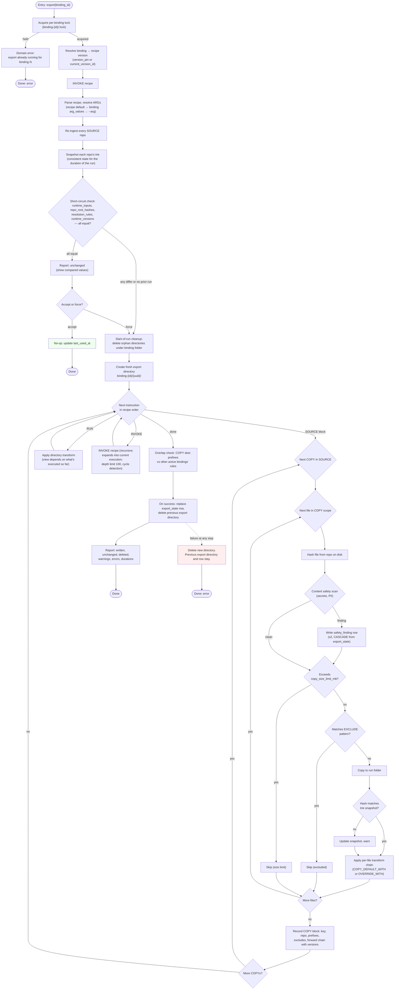

<!-- docs/design/4_EXPORT.md -->

# Export

Export runs a build recipe's instructions in order on a fresh directory.
`SOURCE` blocks ingest and `COPY` files in. `RUN` applies structural transforms at
its position in the sequence (its view of the folder depends on which SOURCEs
have executed before it). On success the export state row is replaced with each
`COPY` block's recorded rules (including derived reverse chains and override
chains), the template sets used by the forward chains, the structural
transforms, the depth tolerance, and the run's hashes. The previous export
directory is deleted. Watch and short-circuit read that row.

## Export Flow

Referenced by: Export state contract, Export folder contract, Short-circuit
contract, Recipe grammar contract.

**Key properties:**
- Every non-short-circuited export copies every included file. No instruction
  cache, no write skip.
- Each export writes into a fresh directory. On failure it is deleted; the
  previous export directory and row survive.
- Concurrent export of the same binding is rejected. A per-binding lock file
  at `{app_data}/export/binding-{binding_id}/.lock` is acquired at export
  start and released at end (success or failure). A second export of the same
  binding while the lock is held returns a domain error "export already
  running for binding N." Different bindings export concurrently.
- Files in trie but absent on disk at `COPY` fail the instruction. Files above
  `copy_size_limit_mb` are skipped with a warning.

**Context accumulator (ctx) recordings:**

| When | What records to ctx |
|---|---|
| File copied | Repo, source path, dest path |
| File excluded | Path, matched pattern |
| File skipped (size limit) | Path, limit |
| Hash mismatch (trie vs disk) | Path, expected vs actual hash |
| Per-file transform | Transform-specific decisions (via `ctx.context.note`) |
| Directory transform | Transform-specific decisions (flatten encoding, pack boundaries, etc.) |

ctx is ordered by instruction position and path. context-manifest renders it
to `_CONTEXT.yaml`.

**Content safety findings (s2).** The scan runs during the `COPY` pass
(piggybacks on reading file bytes). Findings are written to `safety_findings`
(linked to `export_state`, CASCADE on re-export). Types: `secret_detected` or
`pii_detected`. Findings never block the export or mutate content. Resolution
(allow via allowlist, or dismiss) is in the desktop UI (s2).

## Export State

The record of a binding's last successful export. One row per binding
in `export_state`, replaced on every successful export (ADR-037).

**Fields:**

| Field | Type | What |
|---|---|---|
| `id` | int | PK |
| `pipeline_binding_id` | int FK | Unique: one row per binding. |
| `output_dir` | text | Export directory path (`binding-{id}/{uuid}/`). |
| `runtime_inputs` | JSON | Resolved ARG values plus settings that shaped the run (`copy_size_limit_mb`, `binary_extensions`). |
| `repo_root_hashes` | JSON | `repo_id` to trie Merkle root. Pinned at run start. |
| `resolution_rules` | JSON | Per `COPY` key: `{key, repo, src_prefix, dest_prefix, excludes, forward_chain, derived_reverse_chain, override_chain}`. The `forward_chain` includes transform name, resolved version, and args. `derived_reverse_chain`: the forward chain reversed, each transform that declares `reverses` mapped to its reverse at the recorded version and args; non-reversible transforms skipped. `override_chain`: if the recipe's WATCH block has an OVERRIDE entry for this key, the resolved chain with versions and args; null if no override. Watch reads these at runtime instead of resolving against live transform rows. |
| `runtime_versions` | JSON | Version snapshot of all entities: `{recipes: {main: id, invoked: [id, ...]}, directory_transforms: [{name, version}, ...], template_sets: {name: version, ...}, depth_tolerance: int}`. `depth_tolerance` is from the caller recipe's WATCH block (default 2 if absent). Invoked recipes' DEPTH_TOLERANCE is ignored (lint warning). |

Emitted files (created by directory transforms like pack and context-manifest)
are not tracked in `resolution_rules`. They exist in the export directory but
are transient artifacts of the run, not tracked. Watch resolves through the
original `COPY` rules via the enrichment injected before any directory
transform ran.

**Writers and readers:**

| Who | Operation |
|---|---|
| Export (success) | Replaces the row. Written only on success. |
| Short-circuit | Compares `runtime_inputs`, `repo_root_hashes`, `resolution_rules`, `runtime_versions`. Any differ = full export. |
| Watch (session start + reload) | Reads `resolution_rules` (rules for resolution, per-key `derived_reverse_chain` and `override_chain` for the return step), `runtime_versions.template_sets` (extraction patterns), `runtime_versions.depth_tolerance` (depth check). |
| Watch (reconciliation) | Reads indirectly via the export folder on disk. |

Replacement is DELETE + INSERT inside the same transaction.

**Why it exists:** two consumers. Short-circuit compares all inputs to detect
changes. Watch resolves and reverses with the rules that ran, not the recipe
that is current (a recipe edit or app upgrade can happen between export and
return).

## Short-circuit

The export's only cache. Compares all inputs against the previous run before
executing anything.

**Compared inputs:**

| Input | Source | Compared against |
|---|---|---|
| Runtime inputs | Resolved ARGs + relevant settings | `export_state.runtime_inputs` |
| Repo root hashes | Freshly re-ingested trie Merkle root per `SOURCE` repo | `export_state.repo_root_hashes` |
| Resolution rules | Per `COPY` key: repo, prefixes, excludes, forward chain with versions | `export_state.resolution_rules` |
| Runtime versions | Recipe, invoked recipe, directory transform, and template set versions | `export_state.runtime_versions` |

**Decision:**

| Result | What happens |
|---|---|
| All equal | Report unchanged (show compared values). User chooses: accept (no-op, update `last_used_at`) or force (proceed to full export). |
| Any differ | Full export. |
| No prior run | Full export. |

No instruction-level cache. No per-file skip. Every non-short-circuited export
copies every included file.

## Export Folder

The app-owned directory that holds what was last uploaded.

**Location:** `{app_data}/export/binding-{binding_id}/{export_uuid}/`. Each
export creates a new subdirectory with a generated UUID. The path is stored
in `export_state.output_dir`.

**Ownership rules:**

| Rule | Detail |
|---|---|
| App-owned | The app controls this directory entirely. |
| Means | "What was last uploaded." |
| Written by | Export only. |
| Not written by | Watch never writes here. A placement updates the trie, not the export folder. |
| Foreign files | Only the directory matching `export_state.output_dir` is kept. Others are cleaned up. |
| Refuses | Export refuses to run into a registered repo or a directory containing `.git`. |

**Export and cleanup:**

| Step | What happens |
|---|---|
| New export | Create `binding-{binding_id}/{new_uuid}/`, build export into it. |
| On success | Replace `export_state` row (stores `output_dir`). Delete the previous export directory (from the old row's `output_dir`). |
| On failure | Delete the new directory. Previous export directory and row stay. |
| Crash recovery | On startup, delete any directory under `binding-{binding_id}/` that doesn't match the current `export_state.output_dir`. |
| Concurrent rejected | Two concurrent exports of one binding: second is rejected via per-binding lock file. Different bindings export concurrently. |

**Overlap warning:** during the `COPY` pass, if a file is written to a
`dest_path` that already exists in the run folder (placed by an earlier `COPY`
block in this run or a different `SOURCE`), a warning is emitted in the run
report. The second write wins. The warning names both `COPY` keys. This is
informational; it does not block the export.

**Reconciliation reads:** the poll listener indexes the export folder's
basenames at session start and re-indexes on pipeline config changes. A
download whose normalized basename and hash match an exported file is an
unchanged re-download and is skipped.

## Context Accumulator

A run-scoped key-value log available to every instruction during export.
Ordered by `(instruction_position, path)`, never by arrival time.

**API:** `ctx.context.note(key, value)` appends one entry.

**What records to it:**

| Source | What it records |
|---|---|
| `COPY` (success) | Repo, source path, dest path |
| `COPY` `EXCLUDE` (match) | Path, matched pattern |
| `COPY` (size skip) | Path, limit |
| `COPY` (hash mismatch) | Path, expected vs actual hash |
| Per-file transform | Transform-specific decisions (via `ctx.context.note`) |
| flatten | Delimiter, encoding convention, dotfile mappings |
| pack | Pack boundaries, format, skipped binaries |
| context-manifest | (Reads the accumulator; does not write to it) |
| Custom transforms | Anything via `ctx.context.note` |

**Consumer:** `context-manifest` renders the accumulated log to `_CONTEXT.yaml`.
The accumulator is not persisted; it lives for the duration of one export.

## Run Report

The structured output of an export.

| Field | What |
|---|---|
| `written` | Count of files written to the run folder. |
| `unchanged` | Count when short-circuit accepted (no-op). |
| `deleted` | Count of files in the previous export directory not present in the new one. |
| `warnings` | List: files matching no enrichment entry (will-not-round-trip), overlap check findings, hash mismatches, size-limit skips, content safety findings. |
| `errors` | List: `COPY` failures (file absent on disk), transform failures. |
| `durations` | Per-instruction and per-phase timings (ingest, copy+transform, directory transforms, swap). |

`--json` emits the report as a structured JSON object. `--dry-run` runs into
the new directory, reports the diff against the previous export (files to write,
unchanged, to delete), and deletes the new directory without replacing.

