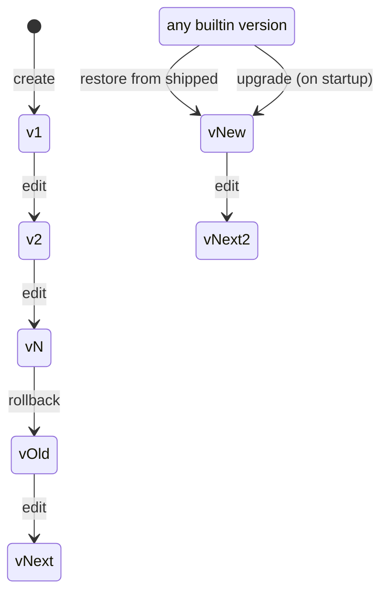

<!-- docs/design/6_VERSIONING.md -->

# Audit & Versioning

## Versioning


Pointer-based versioning for three entities: `build_recipes`, `transforms`,
`templates`. See the Versioning operations state diagram for the visual.

**Model:**

| Property | Rule |
|---|---|
| Pointer | Parent entity holds `current_version_id` FK to the active version row. |
| Version rows | Immutable once created. `(parent_id, version)` unique. |
| `current_version_id` | Nullable only inside the creation transaction. Never null after commit. |
| `source` column | The authoritative text (recipe text, JS module, template text). The word "snapshot" is reserved for `file_history`. |

**Operations:** see Versioning operations diagram. Create, edit, rollback,
restore-from-shipped, prune, soft delete.

**Builtin protection:**

| Rule | Detail |
|---|---|
| `curation = builtin` rows | Cannot be soft-deleted or hard-deleted (app rule). |
| Edit allowed | Creates a new version, moves pointer. Same as any entity. |
| Restore from shipped | Reads the current shipped content from the binary, inserts it as a new version, moves pointer. Same operation as an edit, source is different. |

**Upgrade behavior:** on startup, the app compares the embedded shipped content
against each builtin entity's current version source. If they differ, a new
version is inserted and the pointer moves. The previous version stays as a
rollback target.

**Not prunable:** current, pinned by any binding, referenced by `export_state`
(via `runtime_versions` JSON), `file_history`, or `watch_match_candidates`.

**Deletion lifecycle:** soft delete sets `deleted_at` (entity disappears from
queries and UI, all references stay intact). Prune removes eligible version
rows by date or count. Hard delete removes the parent row once no
version rows remain and no FKs reference it. `file_history` and
`watch_match_candidates` use SET NULL on `build_recipe_version_id` (release their
hold on delete). `export_state` references versions inside JSON
(`runtime_versions`); pruning checks these before deleting a version row.

**repo_versions** is the exception: append-only, not pointer-based.
The repo's config columns are the live state. Each config edit appends a
history row snapshotting the current values. Rollback restores the old values
and appends a new history row.

Every pointer move (edit, rollback, restore, upgrade) triggers a watch state
reload.
### Operations diagram

Referenced by: Versioning contract.

Models pointer movement on the three versioned entities: build_recipes,
transforms, and templates. Every transition bumps watch `map_generation`.



**Operations:**

| Operation | What happens |
|---|---|
| **Create** | Insert version 1, set pointer. |
| **Edit** | Insert version N+1, move pointer. Old version stays. |
| **Rollback** | Move pointer to older version. Nothing deleted. |
| **Restore from shipped** | Read shipped content from binary, insert as new version, move pointer. Builtin entities only. |
| **Upgrade** | On startup, if embedded content differs from current version, insert as new version, move pointer. Automatic. |
| **Prune** | Delete old version rows by date or count. Constrained by the not-prunable rules. |
| **Soft delete** | Set `deleted_at` on the parent entity. Queries filter by `deleted_at IS NULL`. Builtin rows cannot be soft-deleted. |

**Rules:**
- Version rows are immutable. `(parent_id, version)` unique.
- `current_version_id` never null after commit.
- `curation=builtin` rows cannot be deleted.

**Not prunable (prune skips these):** a version row that is current, pinned by
any binding, or referenced by `export_state` (via `runtime_versions` JSON),
`file_history`, or `watch_match_candidates`. Everything else is eligible for pruning
by date or count.

## Shipped Defaults


Content embedded in the binary. Seeded into SQLite on first launch or if a
builtin entity is missing at startup.

**Transforms (curation=builtin):**

| Name | Type | reverses |
|---|---|---|
| `enrichment-injection` | file | — |
| `enrichment-trim` | file | `enrichment-injection` |
| `flatten` | directory | — |
| `pack` | directory | — |
| `context-manifest` | directory | — |

**Templates (curation=builtin):**

| Name | Kind | What |
|---|---|---|
| `default` | enrichment | The shipped entry table (see Template contract). |
| `context-manifest` | file | MiniJinja template for `_CONTEXT.yaml`. |

**Recipe (curation=builtin):**

```
ARG repo
COPY_DEFAULT_WITH [enrichment-injection --template-set default]
SOURCE ${repo}:
  COPY . ${repo}/ AS all-files
RUN flatten
RUN context-manifest
```

Name: `shipped-default`.

**Settings:** all keys seeded with defaults (see Settings contract).

## File History

Append-only audit trail of placed files. Only files that were actually written
(to the repo by watch, or to the export directory by export) get an entry.
Skips, flags, and errors are operational events, not content history.

| Field | Type | What |
|---|---|---|
| `id` | int | PK |
| `repo_id` | int FK, nullable | Null for outputs with no single source (packed files, emitted files). |
| `build_recipe_version_id` | int FK, nullable | ON DELETE SET NULL. Null for rollback and flag-approve. |
| `file_path` | text | Repo-relative path. |
| `entry_type` | text | `snapshot` or `diff`. |
| `content` | blob | Post-transform file content (snapshot) or diff. |
| `placed_by` | text | `export`, `watch_auto`, or `watch_manual`. |
| `source_path` | text, nullable | Watch only. Path relative to watch source (or within archive). |
| `created_at` | datetime | |

**Chain model:**

| Rule | Detail |
|---|---|
| Chain key | `(placed_by, repo_id, file_path)`. Export and watch chains are separate (diffs never show enrichment churn). |
| First entry | Always a full snapshot. |
| Every 5th entry | Snapshot. Others are diffs against the previous entry. |
| Content | Post-transform (final state placed in repo or written to output). |

**Operations:**

| Operation | What |
|---|---|
| Write (watch) | Entry per successful placement. |
| Write (export) | Entry per output file (not on short-circuit). |
| Rollback | Reconstruct content from nearest snapshot + diffs forward, write to repo, append new entry with null `build_recipe_version_id`. |
| Prune | Re-snapshot before deleting to keep diff chains intact. |

Index: `(repo_id, file_path, created_at)`.


## Architecture decision records

See `../ADR.md` for the full set (40 records: ADR-001 through ADR-025
carried forward from the original design, ADR-026 through ADR-040 from this
rewrite).
